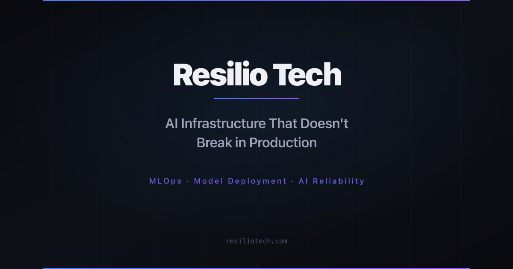

# Resilio Tech — AI Infrastructure & Reliability

> A modern, high-performance website for Resilio Tech — an AI Infrastructure & Reliability company. Built with Next.js 14, TypeScript, and Tailwind CSS.



## 🚀 Overview

Resilio Tech helps companies deploy, scale, and operate AI systems reliably. From model serving to monitoring — production-grade AI infrastructure by engineers who've run systems at enterprise scale. Built with performance, accessibility, and SEO optimization in mind.

### ✨ Key Features

- **🏗️ Modern Architecture**: Next.js 14 with App Router, TypeScript, and Server Components
- **🎨 Beautiful UI**: Custom dark theme with smooth animations using Framer Motion
- **📱 Responsive Design**: Mobile-first approach with Tailwind CSS
- **📝 Content Management**: Markdown/MDX blog system with file-based content in `content/blog/`
- **🚀 Performance**: Optimized with image optimization, code splitting, and caching
- **♿ Accessible**: WCAG compliant with semantic HTML and proper ARIA attributes
- **🔍 SEO Optimized**: Structured data, meta tags, and sitemap generation
- **📊 Analytics**: Google Analytics 4 & Microsoft Clarity with cookie consent
- **🔒 Security**: CSP headers, security best practices, and form validation

## 🛠️ Tech Stack

### Core Technologies
- **Framework**: [Next.js 14](https://nextjs.org/) with App Router
- **Language**: [TypeScript](https://www.typescriptlang.org/)
- **Styling**: [Tailwind CSS](https://tailwindcss.com/)
- **Animations**: [Framer Motion](https://www.framer.com/motion/)
- **Icons**: [Lucide React](https://lucide.dev/)

### Content & Forms
- **Content**: [MDX](https://mdxjs.com/) with [remark](https://remark.js.org/) & [rehype](https://github.com/rehypejs/rehype)
- **Forms**: [React Hook Form](https://react-hook-form.com/) with [Zod](https://zod.dev/) validation
- **Search**: Client-side blog search and filtering

### Development Tools
- **Build Tool**: Next.js built-in webpack configuration
- **Linting**: ESLint with Next.js config
- **Type Checking**: TypeScript compiler
- **Deployment**: [Netlify](https://netlify.com/) with CI/CD

## 📁 Project Structure

```
resiliotech-next/
├── 📂 content/
│   ├── 📂 blog/               # Markdown/MDX blog posts
│   ├── changelog.md            # Changelog content
│   └── roadmap.md              # Roadmap content
│
├── 📂 src/
│   ├── 📂 app/                 # Next.js App Router pages
│   │   ├── 📂 (legal)/         # Legal pages (privacy, terms, cookies)
│   │   ├── 📂 about/           # About page
│   │   ├── 📂 blog/            # Blog listing and [slug] posts
│   │   ├── 📂 contact/         # Contact form page
│   │   ├── 📂 services/        # Services page
│   │   ├── layout.tsx           # Root layout
│   │   ├── page.tsx             # Homepage
│   │   └── sitemap.ts           # Dynamic sitemap generator
│   │
│   ├── 📂 components/           # Reusable React components
│   │   ├── 📂 about/            # About page components
│   │   ├── 📂 analytics/        # Cookie consent & analytics
│   │   ├── 📂 blog/             # Blog components
│   │   ├── 📂 contact/          # Contact form components
│   │   ├── 📂 layout/           # Navigation & Footer
│   │   ├── 📂 sections/         # Homepage sections
│   │   ├── 📂 seo/              # Structured data components
│   │   └── 📂 ui/               # Generic UI components
│   │
│   ├── 📂 data/                 # Static data files
│   │   ├── company.ts           # Company values & milestones
│   │   └── faq.ts               # FAQ data
│   │
│   ├── 📂 lib/                  # Utility functions
│   │   ├── analytics.ts         # GA4 event tracking helpers
│   │   ├── blog-data.ts         # Blog content processing (server-only)
│   │   ├── blog-utils.ts        # Blog utilities (client-safe)
│   │   ├── config.ts            # Site configuration
│   │   └── utils.ts             # General utilities (cn)
│   │
│   ├── 📂 styles/               # CSS files
│   │   └── animations.css       # Custom animation classes
│   │
│   └── 📂 types/                # TypeScript type definitions
│       ├── blog.ts              # Blog-related types
│       └── company.ts           # Company data types
│
├── 📂 public/                   # Static assets
│   ├── 📂 blog-images/          # Blog post cover images
│   ├── 📂 icons/                # PWA icons
│   ├── 📂 og-images/            # Open Graph images
│   ├── 📂 team/                 # Team placeholder images
│   └── 📂 tech-logos/           # Technology stack SVG logos
│
├── next.config.js               # Next.js + MDX + PWA configuration
├── tailwind.config.ts           # Tailwind CSS configuration
├── netlify.toml                 # Netlify build & headers
└── package.json                 # Dependencies and scripts
```

## 🚀 Getting Started

### Prerequisites

Ensure you have the following installed:
- **Node.js** 18+ 
- **npm** or **yarn** package manager
- **Git** for version control

### Installation

1. **Clone the repository**
   ```bash
   git clone https://github.com/your-username/resiliotech-next.git
   cd resiliotech-next
   ```

2. **Install dependencies**
   ```bash
   npm install
   # or
   yarn install
   ```

3. **Start the development server**
   ```bash
   npm run dev
   # or
   yarn dev
   ```

4. **Open your browser**
   Navigate to [http://localhost:3000](http://localhost:3000) to see the website.

## 📜 Available Scripts

| Command | Description |
|---------|-------------|
| `npm run dev` | Start development server at localhost:3000 |
| `npm run build` | Build production-ready application |
| `npm run start` | Start production server (requires build) |
| `npm run lint` | Run ESLint code quality checks |
| `npm run type-check` | Run TypeScript type checking |
| `npm run export` | Export static site (if using static export) |

## 🎨 Design System

### Color Palette

Our design uses a sophisticated dark theme with accent colors:

```css
/* Primary Colors */
--background: #0a0a0a        /* Main background */
--surface: #111111           /* Card surfaces */  
--surface-elevated: #1a1a1a  /* Elevated surfaces */
--border: #333333            /* Border color */

/* Accent Colors */  
--primary: #00D4FF           /* Primary brand color */
--secondary: #6366f1         /* Secondary actions */
--accent: #10b981            /* Success/highlights */

/* Text Colors */
--text-primary: #ffffff      /* Primary text */
--text-secondary: #d4d4d8    /* Secondary text */
--text-muted: #9ca3af        /* Muted text */
```

### Typography

- **Primary Font**: Inter (system-ui fallback)
- **Font Sizes**: Responsive scale from 12px to 64px
- **Line Height**: Optimized for readability (1.5 - 1.7)

### Animations

- **Entrance Animations**: Fade-in, slide-up effects
- **Hover Effects**: Scale, glow, and color transitions
- **Page Transitions**: Smooth loading states
- **Scroll Animations**: Intersection Observer based

## 📝 Content Management

### Blog Posts

Blog posts are written in MDX format and stored in `content/blog/`. Each post includes:

```markdown
---
title: "Your Blog Post Title"
description: "Brief description of the post"
date: "2024-01-15"
updatedAt: "2024-01-20"
author: "Resilio Tech Team"
category: "mlops"
tags: ["mlops", "kubernetes", "ai-reliability"]
coverImage: "/blog-images/your-image.svg"
featured: true
---

Your content here...
```

### Adding New Content

1. **Blog Posts**: Create new `.md` or `.mdx` files in `content/blog/`
2. **Cover Images**: Add to `public/blog-images/`
3. **Company Data**: Edit `src/data/company.ts` and `src/data/faq.ts`

## 🌐 SEO & Performance

### SEO Features

- **Structured Data**: JSON-LD for rich snippets
- **Meta Tags**: Dynamic Open Graph and Twitter cards
- **Sitemap**: Auto-generated XML sitemap
- **Robots.txt**: Search engine directives
- **Canonical URLs**: Proper URL canonicalization

### Performance Optimizations

- **Image Optimization**: Next.js Image component with WebP
- **Code Splitting**: Automatic route-based splitting
- **Lazy Loading**: Components and images
- **Caching**: Static generation with ISR
- **Bundle Analysis**: Webpack bundle optimization

### Core Web Vitals

Target metrics:
- **LCP (Largest Contentful Paint)**: < 2.5s
- **FID (First Input Delay)**: < 100ms
- **CLS (Cumulative Layout Shift)**: < 0.1

## 🔒 Security

### Security Features

- **CSP Headers**: Content Security Policy implementation
- **Form Validation**: Client and server-side validation
- **XSS Protection**: Built-in Next.js protections
- **HTTPS Only**: Secure connections enforced
- **Dependencies**: Regular security updates

### Best Practices

- Sanitized user inputs
- Secure environment variables
- Protected API routes
- Safe external link handling

## 🚀 Deployment

### Netlify Deployment

1. **Connect Repository**: Link your Git repository to Netlify
2. **Build Settings**:
   ```toml
   [build]
   command = "npm run build"
   publish = ".next"
   ```
3. **Environment Variables**: Set any required environment variables
4. **Deploy**: Automatic deployments on git push

### Manual Deployment

```bash
# Build the application
npm run build

# Start production server
npm run start
```

## 🔧 Configuration

### Environment Variables

Create a `.env.local` file for local development:

```env
# Optional: Add any API keys or configuration
NEXT_PUBLIC_SITE_URL=http://localhost:3000
```

### Customization

1. **Colors**: Modify `tailwind.config.ts`
2. **Typography**: Update font imports in `layout.tsx`
3. **Content**: Edit files in `src/data/` and `content/`
4. **Components**: Customize components in `src/components/`

## 🤝 Contributing

1. Fork the repository
2. Create a feature branch (`git checkout -b feature/amazing-feature`)
3. Make your changes
4. Commit your changes (`git commit -m 'Add amazing feature'`)
5. Push to the branch (`git push origin feature/amazing-feature`)
6. Open a Pull Request

### Development Guidelines

- Follow existing code style and conventions
- Write TypeScript for type safety
- Add proper documentation for new features
- Test your changes across different devices
- Ensure accessibility standards are met

## 📄 License

This project is licensed under the MIT License - see the [LICENSE](LICENSE) file for details.

## 📞 Support

For support and questions:

- **Email**: contact@resiliotech.com
- **Website**: [resiliotech.com](https://resiliotech.com)
- **Issues**: [GitHub Issues](https://github.com/your-username/resiliotech-next/issues)

## 🏆 Acknowledgments

- **Next.js Team** for the amazing framework
- **Tailwind CSS** for the utility-first CSS framework
- **Framer Motion** for smooth animations
- **Lucide** for beautiful icons
- **Netlify** for seamless deployment

---

<p align="center">
  <strong>Built with ❤️ by the Resilio Tech Team</strong>
</p>

<p align="center">
  
  
  
  
</p>
